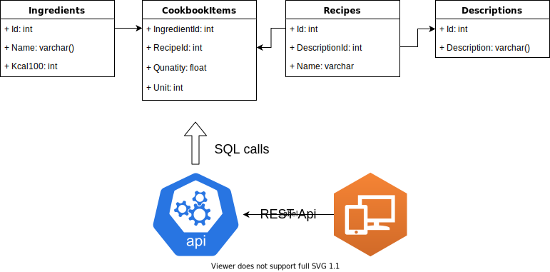

# personal-coobook

Technology stack:

- SQL server and SSMS
- .NET 5.0

App flowchart

Personal Cookbook project was made to organize daily diet and store our favourite recipes. App model consists of three main components:

- SQL database
- Web Api
- Web Page.

Web page communitates with API in order to proceed operations on database like updating Ingredients table or adding new recipe. Both Web Api and server side of the web page take an adventage of .net 5.0 in backend layer.